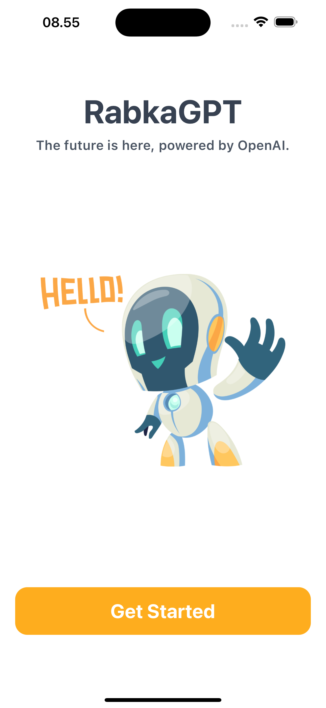
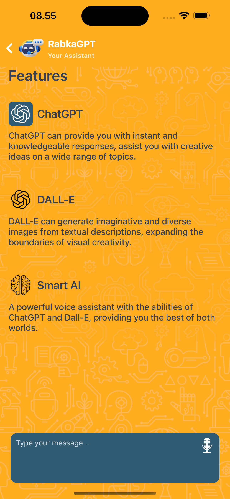
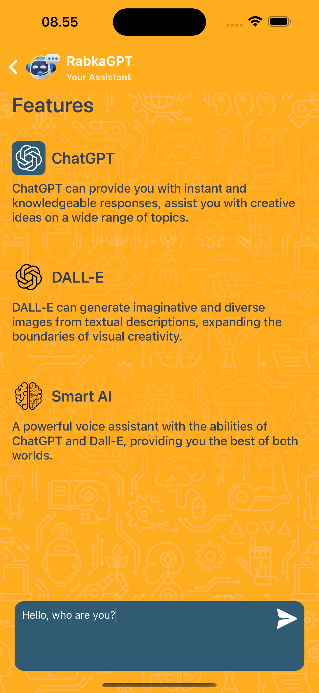
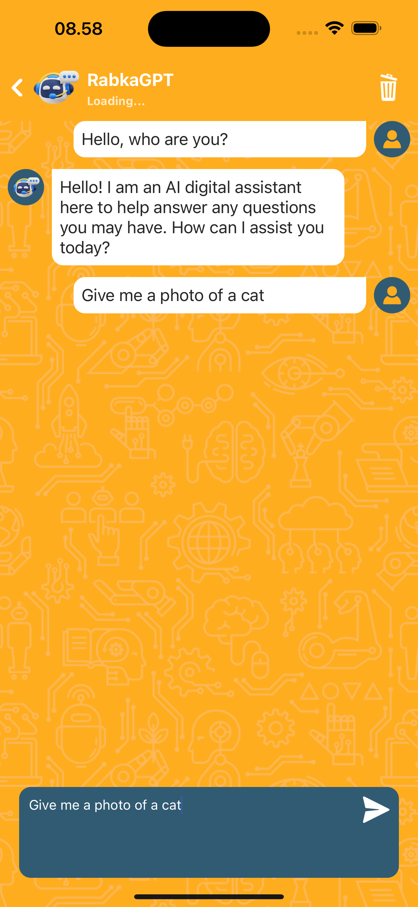
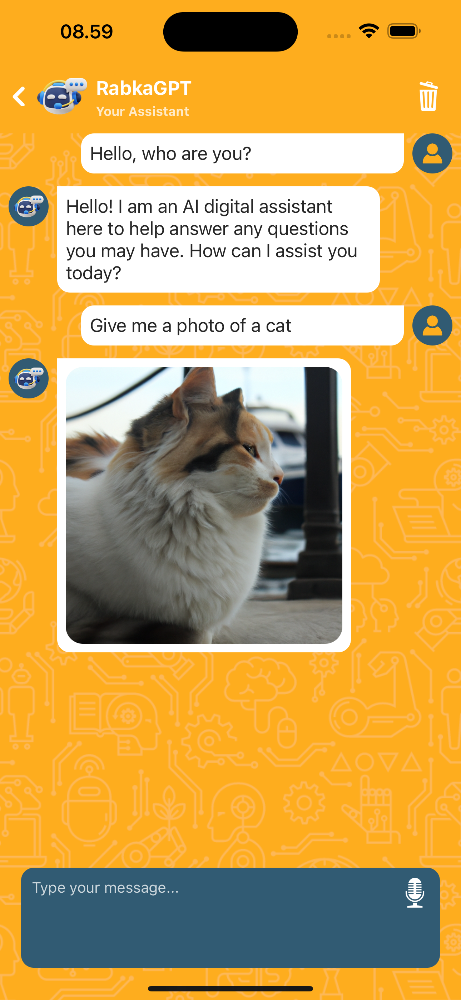

# RabkaGPT (AI-Voice-Assistant-React-Native)

    
    
    
    
    

## Get Started

1. Update your API KEY OPENAI in the `.env.example` file.
2. Change the file name from `.env.example` to `.env`.
3. Install dev dependencies:

### `npm install` or `yarn install`

## Get API KEY

1. Go to https://openai.com 
2. Create a new account and get your api key 
3. Add the api key in constants/index.js file

## Build Pod File

### `cd ios` and `pod install`

## Run The App

#### `npm run ios` or `yarn run ios`

Like `npm start` / `yarn start`, but also attempts to open your app in the iOS Simulator if you're on a Mac and have it installed.

#### `npm run android` or `yarn run android`

Like `npm start` / `yarn start`, but also attempts to open your app on a connected Android device or emulator. Requires an installation of Android build tools (see [React Native docs](https://facebook.github.io/react-native/docs/getting-started.html) for detailed setup).

 

💙 If you like this project, give it a ⭐ and share it with friends!

  
  
  

